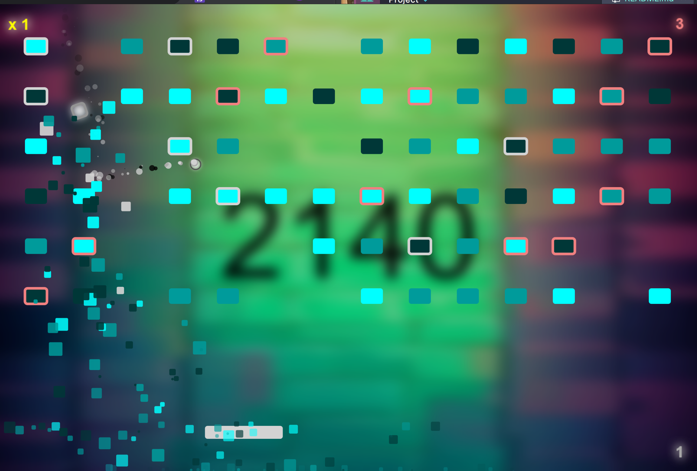

# Brick Breaker Game

---

## Project Information
The Brick Breaker game revitalizes the classic arcade genre with a Java-based rendition that challenges players to 
fire the randomly placed cannon (but on a fixed y position) and then controlling a paddle to bound the orb upwards to demolish a dynamic array of brick formations.
As the game progresses, each level introduces a tougher level of bricks with more health, but balancing them out by also generating more collectible bricks to introduce a fun yet layer of strategic depth.
This game was developed with much great **focus on aesthetics**.



This project was developed solely on JavaFX version 21 only by utilizing dependencies from the JavaFX library in Maven.

---

## Table of Contents
- [Project Setup](#project-setup)
  - [Command Line](#command-line)
  - [Intellij](#intellij)
- [Project Structure](#project-structure)
- [Refactoring](#refactoring)
  - [MVC Pattern](#mvc-pattern)
- [Project New Heavy Classes](#project-new-heavy-classes)
- [Project Features](#project-features)
  - [Particle Physics](#particle-physics)
  - [Brick Explosion](#brick-explosion)
  - [Orb Tail Trails](#orb-tail-trails)
  - [Cannon Aim Line](#cannon-aim-line)
- [Features To Be Implemented](#features-to-be-implemented)
- [Code Insurance](#code-insurance)
- [Project Hinderings](#project-hinderings)

---

## Project Setup
The project was tested on 2 different machines, and was found to be working successfully on both using both the command line and Intellij tools.

### Command Line

To run this project form the command line, follow these steps:
1. Open your command line terminal.
2. Navigate to the root directory of the project where the `pom.xml` file is located.
3. Then, execute the following Maven command:
  ```
  mvn clean
  ```
   - This command cleans the `target` directory, removing all previously compiled Java classes and resources.
4. Next, execute the following Maven command:
  ```
  mvn install
  ```
   - This command compiles the source code of the project.
5. Alternatively, you can execute the following combined command:
  ```
  mvn clean install
  ```

### Intellij

To run this project from Intellij, follow these steps:
1. Open Intellij IDEA.
2. Choose 'Open form the welcome screen or File > Open' from the menu.
3. Navigate to and select the root directory of the project where the `pom.xml` file is located.
4. In the 'Maven' tool window, which is usually on the right tab sections side, expand the 'Lifecycle' section.
5. Double-click on the 'clean' to execute the cleaning process.
6. Then double-click on 'install' to build the project and install the dependencies.
7. After the build completes, you can then run the `Main.java` file located in the `src/main/java/breakout` directory.

---

## Project Structure

This project is mainly divided into parts of two major packages. One which is the core and the other the overall external framework
that heavily depends on the core package.

### Core Package
The core package can be assigned with a group and artifact ID and be used as a Maven dependency. However for better readability for this project,
it was left within the same directory as the main project.
The core folder is created to account for the separation of concerns and to ensure that the core functionalities of the game can be reused in other projects.

### External Framework Package
Any package then which employs the core directory will be able to implement and further enhance its functionality.
For instance: the `entities` folder in the core package contains `Player` and `Enemy` actors, and a `Projectile` entity.
Their broad terms and surface functionalities serves the purpose of being reused in multiple projects.
In the case of this project, the `players` are further specialized to `Paddle` and `Cannon`, while the `enemies` are further specialized to `Brick` classes.
`projectiles` are then specialized to `Orb` class.

---

## Refactoring
### MVC Pattern

The project designs the MVC in such a way where all actors (player, block) and projectiles (ball) are considered entities,
which are the models such as the `Paddle`, `Orb`, `Brick`. The controllers will be used to dispatch any screen major actions including the `ArenaController`. 
While the parts which involve rendering were assigned to two separate class functionalities namely, the screen such as `ArenaScreen` handle the screen states, 
game and element logics, and contains its respective view such as `ArenaView` which contains all the static UI components.

1. Original Class Modifications
    - Entities that were found in the `Main` and `GameEngine` original classes were split up into their respective classes
    - Application logic like the start, and stop methods were all moved to the `Launcher` class which focus primarily on handling the state of the application itself.
    - The main functionalities of The player class has been moved to a new class called `Paddle`
    - The ball functionalities have been moved to the `Orb` and `StandardOrb` classes
    - The original `Block` class has been renamed to `Brick` and `CollectibleBrick` where each respective functionality is implemented in.
    - The original `LoadSave` class has been renamed to `QueryBuilder` whereby some functionalites have also been delegated to classes such as
`Connector`, and `SchemaBuilder`.
    - The `Score` original class has its functionalities moved to the `Paddle` class. as most of the code involves handling the display logic rather than the state itself. 
    - The `Bonus` original class has been redefined to `Collectible` class which contains the main functionalities for all powerups
which will be extended by more specific classes like `LifeCollectible` and `LargePaddleCollectible` which will take effect once their respective brick type gets destroyed.

2. Design Patterns
    - Abstract Factory patterns were use a lot mainly for the factories involving generating bricks including `CollectibleBrickFactory` and `StandardBrickFactory`.
    - Proxy pattern was used for the `DB` class which provides a gateway access to the database `Connector`, then the `SchemaBuilder`, followed by the `QueryBuilder`.
   The access are via the same effect like method chaining making it look like coming from a single class.
    - IoC pattern was used by the `Container`, `ServiceBinder` classes used for provider registrations, and `DependenciesInjectable` to provide access to all the injected dependencies.
    - Open-Closed principles were used for classes like `Settings` which ensures that no changes can be done to its property externally.
    - Polymorphism was used for classes like `Logger`, `Screen`, and `View`. More explicit ones include `PlayerFactory`, and `EnemyFactory` as well as some of those in the `contracts` core package 
whereby implementations are being left for the future but currently acts as a marker for its type.
    - Abstract classes were used for multiple classes `LifeBrick`, and `LargePaddleBrick`. These classes are currently extended by one type of shape.
However, future developers can add more shape types to the bricks which will extend from these abstract classes, allowing to define common methods and fields that can be shared,
as well as maintaining consistent implementations for better redability and debugging
    - Singleton pattern was used for classes like `ImagerySystem`, `AudioSystem` and `Filesystem` as the entire application should only
run on one system each. This avoids constant unnecessary recreation which can introduce overhead to the system.

---

## Project New Heavy Classes
Throughout the project, there were a substantial amounts of new classes, however some have much greater
functionality contribution to the application's backend support.

### Logging
The `Logger` class was created to provide standardized handling for all the extended logger classes. 
It was created to ensure that the application retains the same way of logging but may be different 'severity' 'types' and minor options.
This removes redundant code and code smell whereby necessary changes are much likelier to be needed to change in the `Logger` abstract class 
without having to do the same for all three of its current sub-classes `SystemLogger`, `AuditLogger`, and `EventLogger`.

### Database
Although storage and data are stored in the local files instead of an actual database. it still remains better to simulate the
system of the real world practice. The classes `Connector`, `SchemaBuilder`, and `QueryBuilder` and `DB` were created for this sole purpose.
This allows future developers to easily perform database migration with little efforts and changes of code since it is already set up.
Moreover, if they decide to return to the filesystem again. it would inherently be much easier likewise.

---

## Project Features

### Particle Physics
This is yet the hardest but challenging part of the journey throughout this assignment where I managed to implement the physics aesthetics
on majorly the brick explosion, and orb tail trails, as well as the ball aim line.

### Brick Explosion
The brick explosion mainly uses the `Explosion` class which has a composition relationship with the `Particle` with the multiplicity of 1 to many whereby whenever the
explosion goes inactive, the particles will all immediately go out of state. Each of the particle are calculated based on a fixed engine gravity, air resistance,
a certain factor of bounce as well as the altitude. As the altitude decreases, so will the velocity of the particles increase
imitating how gravity works in real life. They gradually begin to fade as they shrink and eventually disappear.

### Orb Tail Trails
The orb tail trails are implemented using the `Trail` class which has a composition relationship with the `EmittedParticle` class with a multiplicity of 1 to many.
This feature is rather much simpler as it does not act like the "explosion" effect with great effect, rather this is an "emitted" effect
where it should not have high deviation from the previous position of the orb, making it look like a tail. This is implemented using a fixed range of randomization,
within a given spot behind the ball. The multiple particles line-up then creates the illusion of trailing effect.

### Cannon Aim Line
This is rather interesting as this requires to calculate based on the mouse position after consideration of the 
x, y (both being at the top left of the orb), radius centers coordinates of the stationary orb. This projectile is instead dynamic compared to
the traditional (left, right, up down) rotating in 90 degrees almost or all the time, making it rather static and boring. 
With a different firing angle, the orb can then be able to alter its movement much more accordingly to the guidedX and guidedY 
which was the reason why the `GuidedProjectile` class was created for this sole purpose.

---

## Features To Be Implemented

By far, all features implemented are complete and do not have any bugs or issues.

Regarding newer features to be implemented. It is recommended for future developers to continue on and add more
brick shapes, and also introduced newer and better physics calculations to the game.

---

## Code Insurance
Test cases using jUnit4 were also created for more crucial method functionalities of classes in the project including 
`PaddleTest`, `StandardOrbTest`, `CannonTest`, `StandardBrickTest`, `StandardBrickFactoryTest`, `StandardPlayerTest`, `StandardCanonTest` 
to ensure that the code is working as intended.

Necessary JavaDoc was also created for all classes and methods to ensure that the code is well documented and can be easily understood by future developers.
Some methods may not have JavaDoc as they are self-explanatory and do not require any further explanation, or they are overriden from parent classes which already contain JavaDoc comments.

The project was also converted to a Maven project to ensure that it can run without any local dependencies and can instead
operate successfully with libraries from Maven.

---

## Project Hinderings
Throughout the more than the first three quarters of the project. Commits, merging and pushes were al of the ordinary. However,
since the last quarter of the project, there were some issues with the git two-auth factor authentication where even correct pins would not allow a sign in
where it was not able to push to the remote repository. This [post](https://www.reddit.com/r/github/comments/16a3izb/2fa_code_problems/) here 
by another person in just 3 months ago as of writing further proves that I am not the only one encountering this issue.
Out of all the ways I tried to recover from this, it was always to no avail.

This issue was only resolve by creating a new account and a new repository and simulating the previous commits and pushes.
Hence, the commit timings may seem very close for some. Regardless, all issues were solve as I was still able to use my 
version control just as usual after the simulations.